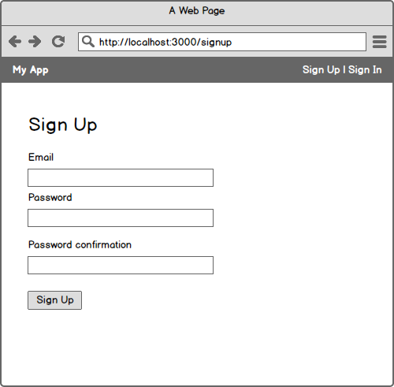
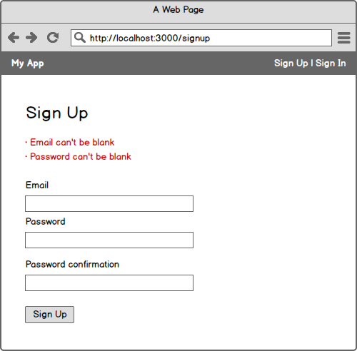
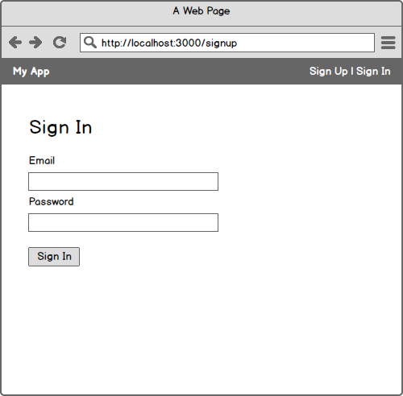
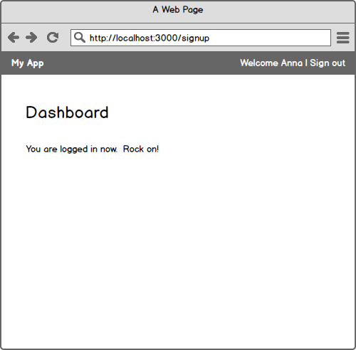
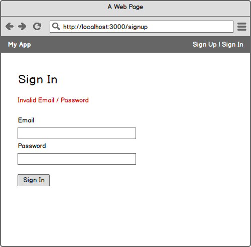

# Form-Based Authentication Stories

This repo accompanies the [Authentication Learning Experience](https://students.galvanize.com/curriculums/6/learning_experiences/21)

**Users can view the sign up form**

> When a user goes to the app
and clicks on the "sign up" link in the nav bar
then they should see a form
with fields for email, password and (optionally) password validation

**Users can view the sign up form**

> When a user goes to the sign up form
and fills in the form with valid info
and clicks submit
then the user should be able to sign in

**Users see validations errors when sign up fails**

> When a user goes to the sign up form
and fills in the form with invalid info
and clicks submit
then the user should see errors

Errors should appear when:

- email is invalid (blank or has no "@")
- password or password confirmation are blank
- password doesn't match confirmation
- password doesn't match requirements (such as minimum length)
- email has already been taken

**Users can sign in with valid credentials**

> When a user goes to the sign in form
and fills in the form with valid credentials
and clicks submit
then the user should be signed in
and the user should see their name in the navbar

When looking up the email, consider doing a case-insensitive lookup.  So if the user signed up with "JOE@example.com", they should be able to sign in with "joe@EXAMPLE.com"

**Users see error messages when they attempt to sign in with invalid credentials**

> When a user goes to the sign in form
and fills in the form with invalid credentials
and clicks submit
then the user should not be signed in
and the user should see error messages

Handle the following errors:

- the email does not exist in the database
- the email / password combination are incorrect
- the email or password are blank

In all cases, the message should be "Invalid email / password"

## Resources

- http://blog.mongodb.org/post/32866457221/password-authentication-with-mongoose-part-1
- https://github.com/ncb000gt/node.bcrypt.js/
- https://github.com/expressjs/session
- http://www.lassosoft.com/Tutorial-Understanding-Cookies-and-Sessions
